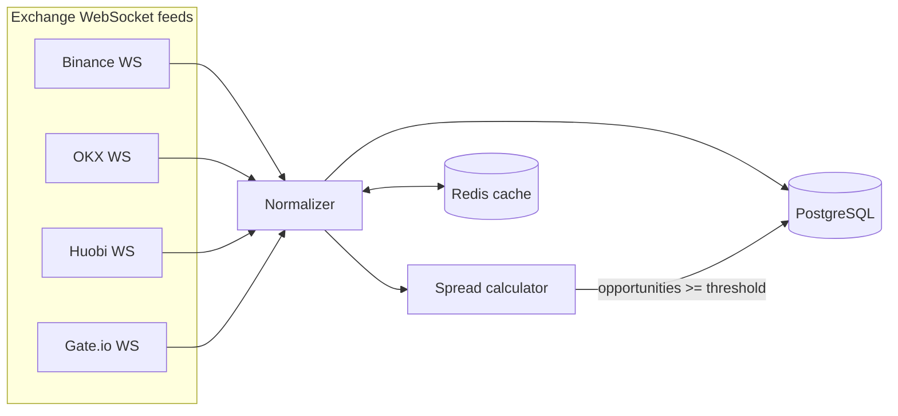

# Crypto Arbitrage Scanner

> Real-time cross-exchange crypto arbitrage scanner: streams live market data from multiple exchanges over WebSocket, computes spreads in real time, and persists opportunities above a configurable threshold.


---

## Overview

**Crypto Arbitrage Scanner** connects to several centralized exchanges over their
public WebSocket APIs and continuously ingests live order-book / ticker data. Each
incoming quote is normalized into a common `(exchange, symbol, ask, bid)` shape and
written to PostgreSQL, giving a single consolidated view of the best bid/ask across
venues.

On top of that consolidated book, the **spread calculator** compares every pair of
exchanges for each symbol — buying at the lowest ask and selling at the highest bid —
and reports the widest positive spread. Whenever a spread clears a **configurable
threshold** (`SPREAD_THRESHOLD`), the scanner records it as an arbitrage
*opportunity*. A Redis layer is available for low-latency caching of the most recent
quotes.

The project is fully asynchronous: every exchange client is an independent
`asyncio` task, so hundreds of symbols across four exchanges are streamed
concurrently on a single event loop.

## Architecture



```
 Binance ┐
 OKX     ├─▶ Normalizer ─▶ Spread calculator ─▶ PostgreSQL
 Huobi   │        │                                  ▲
 Gate.io ┘        └──────────▶ Redis cache ──────────┘
```

1. **Exchange WS clients** (`app/sockets/<exchange>/ws.py`) subscribe to book-ticker
   / ticker channels and yield raw quotes.
2. **Normalizer** maps venue-specific payloads to a common quote shape.
3. **Spread calculator** (`app/spread/spread_calculator.py`) finds the best
   buy-low / sell-high pair per symbol.
4. **PostgreSQL** stores the latest quotes (`tokens`) and detected
   opportunities (`spread_opportunities`); **Redis** caches hot quotes.

## Tech Stack

| Area            | Technology                          |
| --------------- | ----------------------------------- |
| Language        | Python 3.10+                        |
| Concurrency     | `asyncio`                           |
| Live feeds      | `websockets`, `aiohttp`             |
| ORM / DB access | SQLAlchemy 1.4 (async), `asyncpg`   |
| Migrations      | Alembic                             |
| Database        | PostgreSQL 15                       |
| Cache           | Redis 7                             |
| Config          | Pydantic settings (`.env`)          |
| Infra           | Docker / Docker Compose             |

## Supported Exchanges

| Exchange | Channel(s)               | Feed                             |
| -------- | ------------------------ | -------------------------------- |
| Binance  | `bookTicker`, `ticker`   | `stream.binance.com`             |
| OKX      | `books5`, `tickers`      | `ws.okx.com`                     |
| Huobi    | `ticker`                 | `api.huobi.pro`                  |
| Gate.io  | `spot.book_ticker`, `spot.tickers` | `api.gateio.ws`        |

## Project Structure

```
crypto-arbitrage-scanner/
├── app/
│   ├── config.py                 # Pydantic settings (env-driven, no secrets)
│   ├── main.py                   # Entry point: runs all feeds concurrently
│   ├── models.py                 # SQLAlchemy models (Token, SpreadOpportunity)
│   ├── crud.py                   # Persistence helpers
│   ├── database/
│   │   ├── postgres.py           # Async engine + session factory
│   │   └── redis.py              # Async Redis cache
│   ├── sockets/
│   │   ├── binance/{ws,symbols}.py
│   │   ├── okx/{ws,symbols}.py
│   │   ├── huobi/{ws,symbols}.py
│   │   └── gateio/{ws,symbols}.py
│   ├── spread/
│   │   └── spread_calculator.py  # Cross-exchange spread logic
│   ├── migrations/               # Alembic environment + versions
│   └── alembic.ini
├── docker-compose.yml            # PostgreSQL + Redis
├── requirements.txt
├── Makefile
├── .env.example
├── LICENSE
└── README.md
```

## Getting Started

### 1. Clone and configure

```bash
git clone <your-fork-url> crypto-arbitrage-scanner
cd crypto-arbitrage-scanner

cp .env.example .env
# Edit .env and set DB_URL / REDIS_URL / SPREAD_THRESHOLD to taste.
```

### 2. Start infrastructure

```bash
docker-compose up -d      # PostgreSQL + Redis
# or: make up
```

### 3. Install dependencies

```bash
python -m venv venv && source venv/bin/activate
pip install -r requirements.txt
# or: make install
```

### 4. Apply database migrations

```bash
cd app && alembic upgrade head
# or from the repo root: make upgrade
```

### 5. Run the scanner

```bash
python -m app.main
# or: make run
```

You should start to see live quotes streaming from each exchange, and
opportunities above `SPREAD_THRESHOLD` being persisted to PostgreSQL.

## Configuration

All configuration is read from the environment (see `.env.example`):

| Variable           | Description                                            | Default                    |
| ------------------ | ------------------------------------------------------ | -------------------------- |
| `DB_URL`           | Async SQLAlchemy connection string                     | — (required)               |
| `REDIS_URL`        | Redis connection string                                | `redis://localhost:6379/`  |
| `SPREAD_THRESHOLD` | Minimum spread (%) worth persisting as an opportunity  | `0.5`                      |
| `DEBUG`            | Verbose SQL / debug logging                            | `false`                    |

No API keys are required — the scanner uses **public** market-data streams only.

## Disclaimer

This is a **demo / educational project** built to showcase an asynchronous,
multi-exchange data-ingestion and spread-analysis pipeline. It is **not financial
advice**, does **not** execute live trades, and ships with **no** real exchange
credentials. The reported spreads are theoretical and ignore trading fees,
withdrawal fees, transfer latency, slippage, and order-book depth. Do not connect
live trading keys to this codebase.

## License

Released under the [MIT License](LICENSE). Copyright (c) 2023-2026 Maksim Slashchev.
